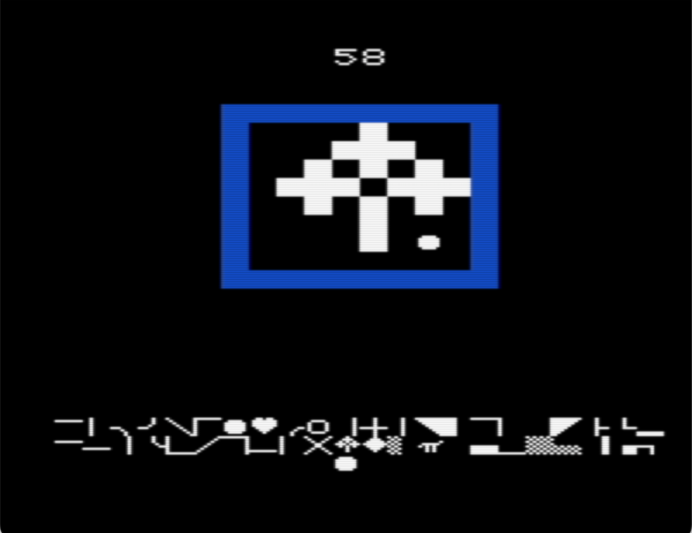
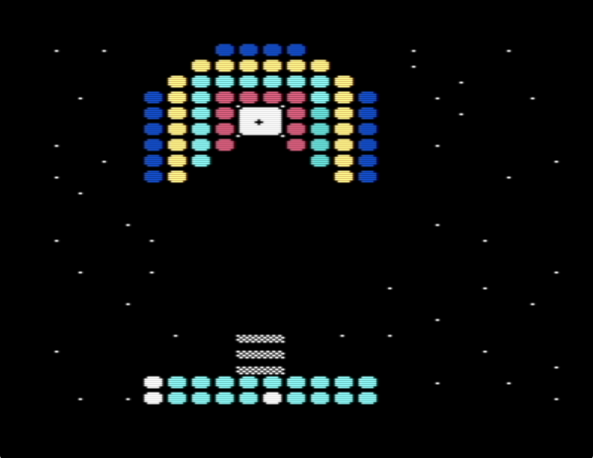

## <b>tiler</b> is a charset and screen editor for the VIC-20




### Build and run in the emulator

```
sh ./build.sh
```

To build tiler the following programs must be installed, with the exception of xvic:

```
vice emulator  xvic
assembler      64tass
cruncher       exomizer
```

### Instructions

```
x           enter character editor mode, or leave it
spacebar    draw
w a s d     movement
semicolon   current char left
quote       current char right
c           copy world
p           paste world
b           bring up overlay, or squelch it
g           increment background color
h           increment border color
z           flip character selection row, visible when overlay is displayed
1-0         change color
m           bucket fill
escape      squelch overlay, or exit save/load mode
f5          toggles between save scene and save charset
f7          toggles between load scene and load charset
```
